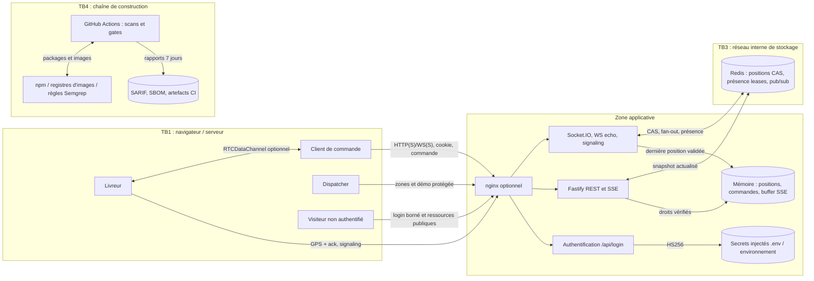

# Threat model STRIDE — service réel
## 1. Périmètre
Application de suivi de livraison, mono-instance et option cluster. Données fictives. BE et ER définis dans [contexte](contexte.md). La menace navigateur est évaluée sur les endpoints effectivement présents.
## 2. DFD

TB2 est la frontière logique entre les rôles et rooms dans le même process. TB1 concerne REST, SSE et le handshake WS/WSS : Origin n'est jamais une identité. TB3 est inaccessible depuis les ports hôte ; aucune valeur client ne choisit une clé Redis arbitraire. TB4 introduit du code tiers : lock versionné, actions épinglées au SHA, scans et permissions minimales. WebRTC ajoute une frontière pair/pair ; ce canal ne modifie pas l'état serveur.
## 3. Analyse STRIDE priorisée
| # | Flux | Catégorie | Menace concrète | Exigence | Priorité |
|---|---|---|---|---|---|
| T1 | Handshake WS/SIO | S | Connexion sans identité, lecture de tous les GPS | JWT strict et cookie protégé | H |
| T2 | Join/REST/SSE | I | Camille lit cmd-102 ou zone dispatcher | Appartenance serveur sur chaque surface | H |
| T3 | position-update | T | Client modifie un autre livreur | Identifiant écrivain issu de la session, rôle livreur | H |
| T4 | Secrets/session | E | Clé faible ou connue permet de signer dispatcher | Secret hors dépôt, minimum 32, algo/issuer/audience | H |
| T5 | Canal public | D | Flood de connexions ou messages | Frames bornées, rate-limit événement et login, protection infra à prévoir | H |
| T6 | GPS concurrents | T | Paquet ancien remplace le plus récent | Timestamp strict, CAS Redis, bornes temporelles | H |
| T7 | HTML/canal | I | XSS lit les données du suivi | CSP sans inline, textContent, HttpOnly | H |
| T8 | Reconnexion | D | Interface reste sur une position ancienne | Rejoin + snapshot, SSE buffer borné | M |
| T9 | Actions métier | R | Écriture contestée sans trace persistante | Audit durable avant production ; démo sans journaux GPS persistants | M |
| T10 | Redis | I | Stockage publié ou rétention illimitée | Ports internes, TTL, absence de volume de persistance | H |
| T11 | Signaling WebRTC | E | Relais offre/candidat à une autre commande | Cible jointe et rôle complémentaire vérifiés | H |
| T12 | npm/CI | T | Package ou action compromis | Lock, SCA, SHA actions, SBOM, scans image | H |
| T13 | Présence | I | Un tiers énumère les utilisateurs actifs | Présence uniquement dans une room autorisée, purge | M |
| T14 | Cookie/session | S | Token volé réutilisé après logout | Expiration 15 min ; révocation/IdP avant production | M |
## 4. Correspondance EBIOS pour toutes les priorités H
| Menace | BE / ER | Source → chemin → impact | Vérification / audit |
|---|---|---|---|
| T1 | BE1,BE4 / ER1,ER4 | Visiteur → handshake nu → fuite GPS | F1, tests security WS/SIO |
| T2 | BE1 / ER1 | Client curieux → id commande → destination de tiers | F2, tests IDOR REST/SSE/join |
| T3 | BE2 / ER2 | Client → écriture GPS d'un livreur → faux suivi | tests écriture interdite |
| T4 | BE4,BE1 / ER4,ER1 | Attaquant → secret connu → faux JWT dispatcher | F3, SAST/secrets, JWT strict |
| T5 | BE3 / ER3 | Bot → frames/flood → suivi indisponible | tests 1008/429, charge ; risque infra résiduel |
| T6 | BE2 / ER2 | Livreur ou réseau → ancien timestamp → retour GPS | test convergence, scénario, CAS cluster |
| T7 | BE1 / ER1 | Entrée hostile → rendu HTML → exfiltration | règle SAST unsafe-html, CSP DAST, test navigateur |
| T10 | BE1 / ER1 | Visiteur → Redis public → positions | compose interne, audit F4, revue config TTL |
| T11 | BE1,BE4 / ER1,ER4 | Pair → target hors commande → données tierces | tests signal refusé, e2e canal direct |
| T12 | BE4,BE3 / ER4,ER3 | Tiers compromis → package/action → service compromis | F5, supply-chain, gitleaks, image, SBOM |
## 5. Risques résiduels
Comptes et droits de démo fixes, pas d'IdP ; pas de révocation individuelle de JWT ; pas de journal d'audit métier durable ; protection contre ouverture massive de connexions à compléter en frontal. Mono-instance volatile ; Redis non persistant. Les mesures réduisent les risques du substrat pédagogique et ne constituent pas une certification de production.

